```{r setup, include=FALSE}
knitr::opts_chunk$set(echo = FALSE)
library(viridis)
```


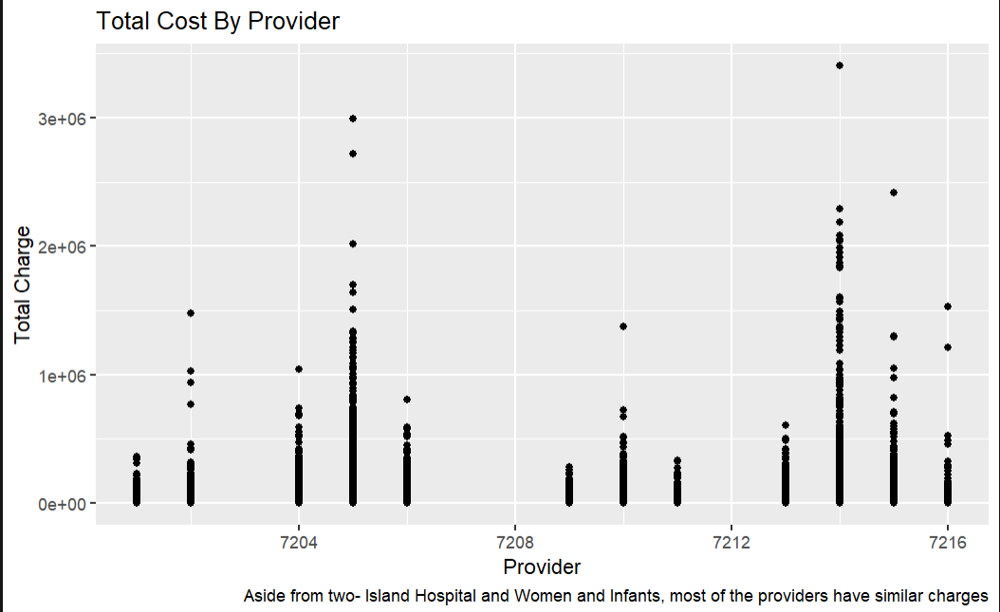{width=80%}
---
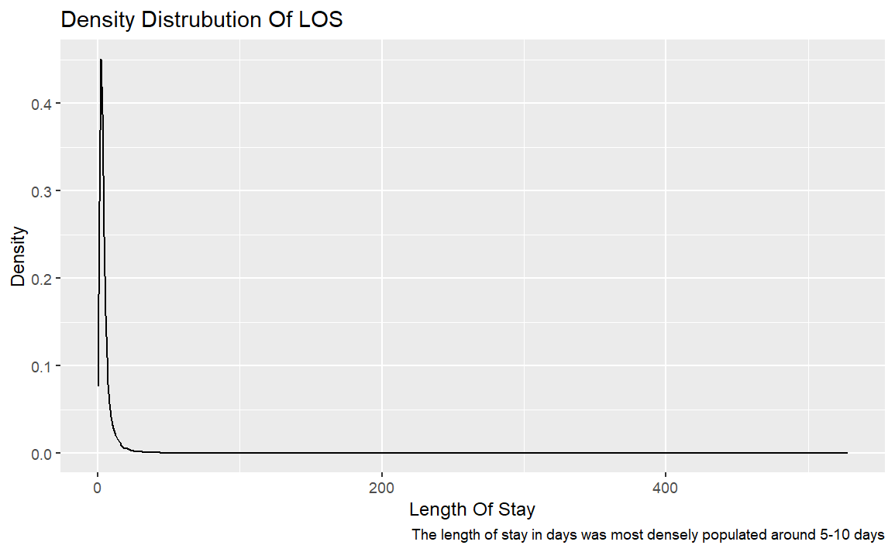{width=80%}
---
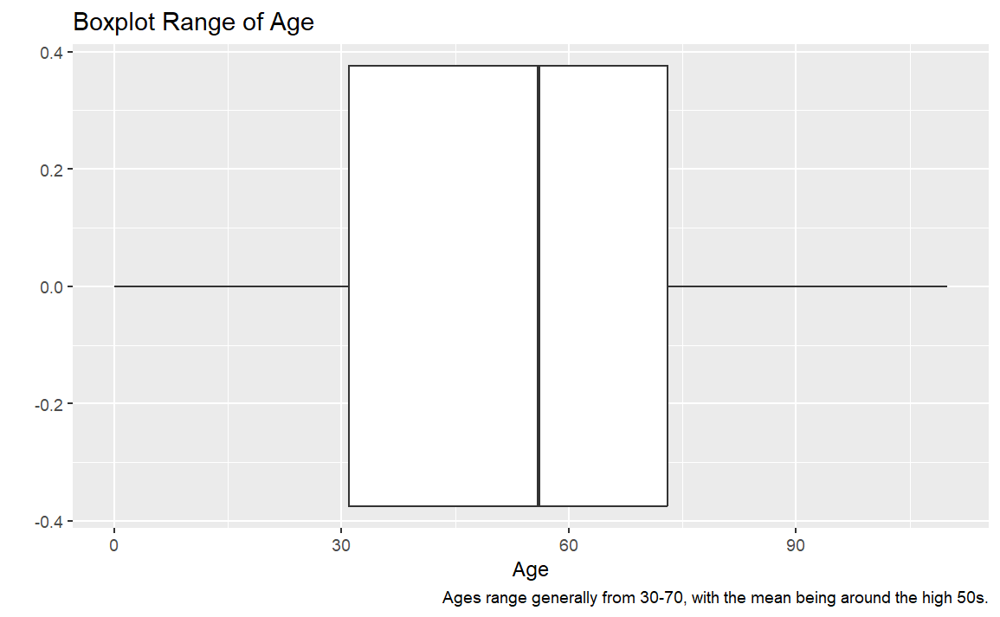{width=80%}
---
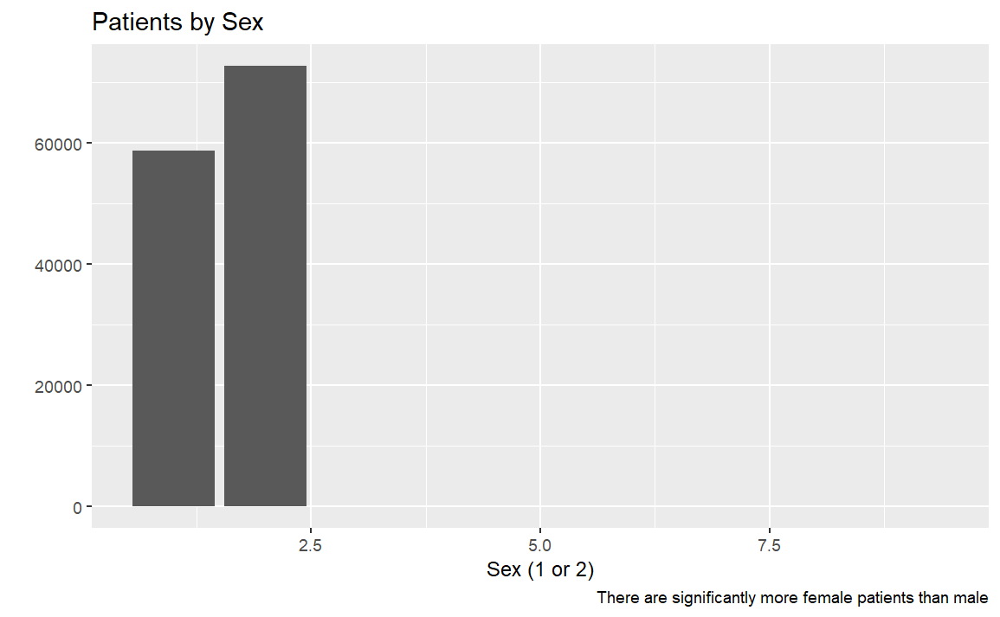{width=80%}
---
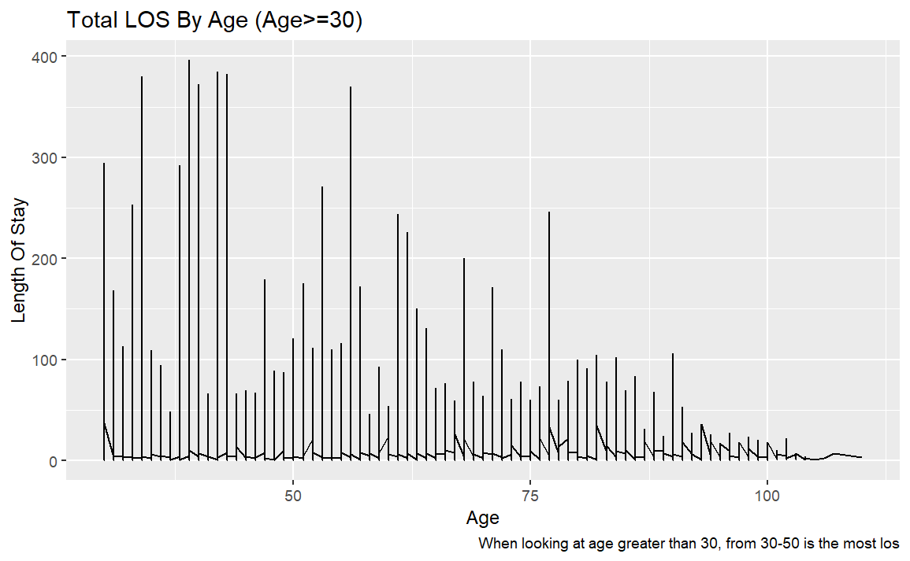{width=80%}
---
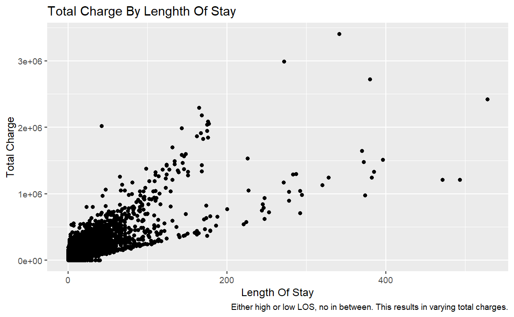{width=80%}
---
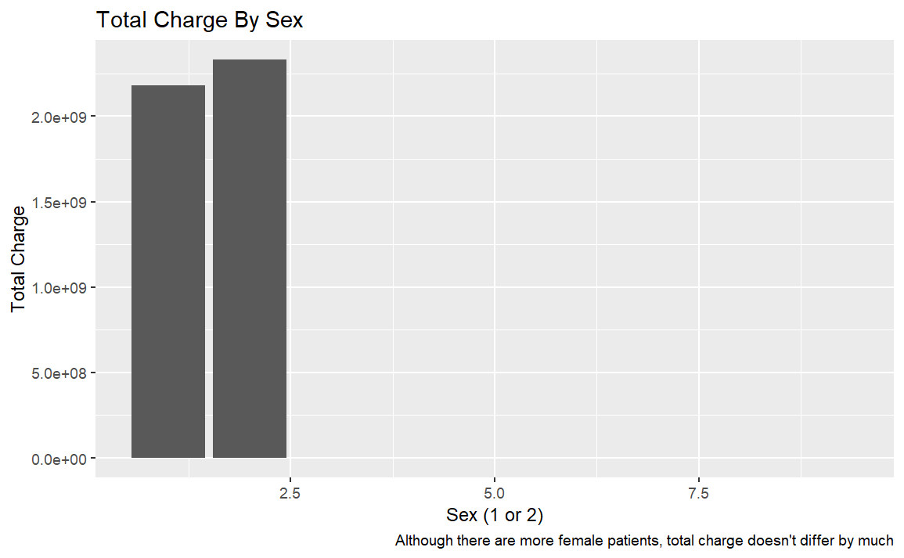{width=80%}
---
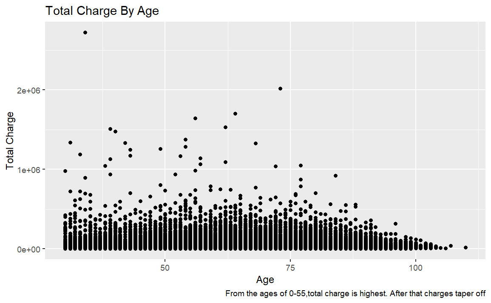{width=80%}
---
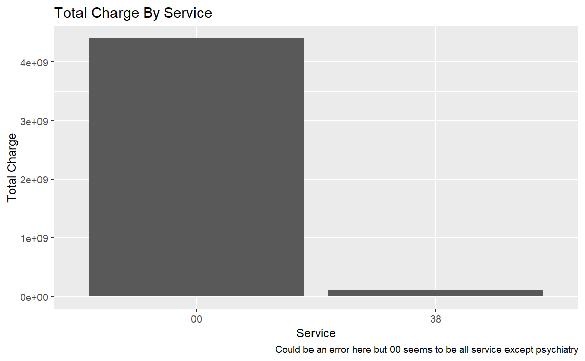{width=80%}
---
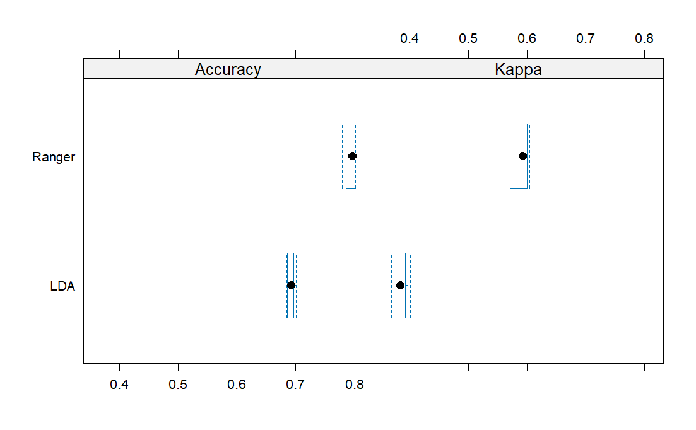{width=80%}
---
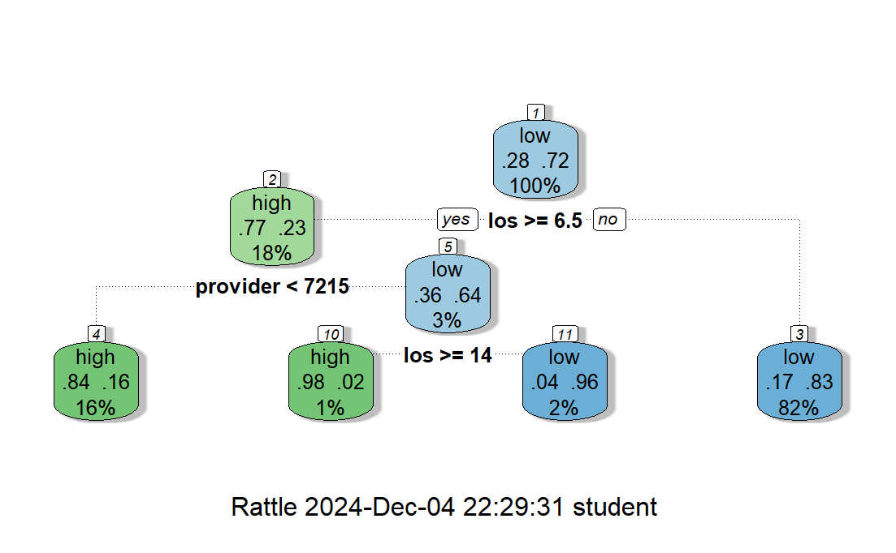{width=80%}
---
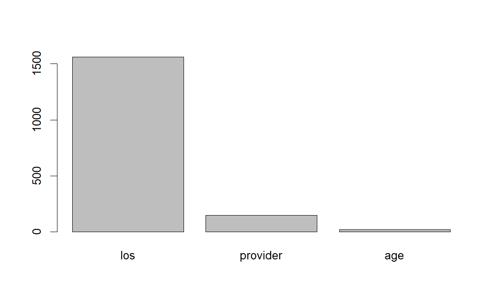{width=80%}
---
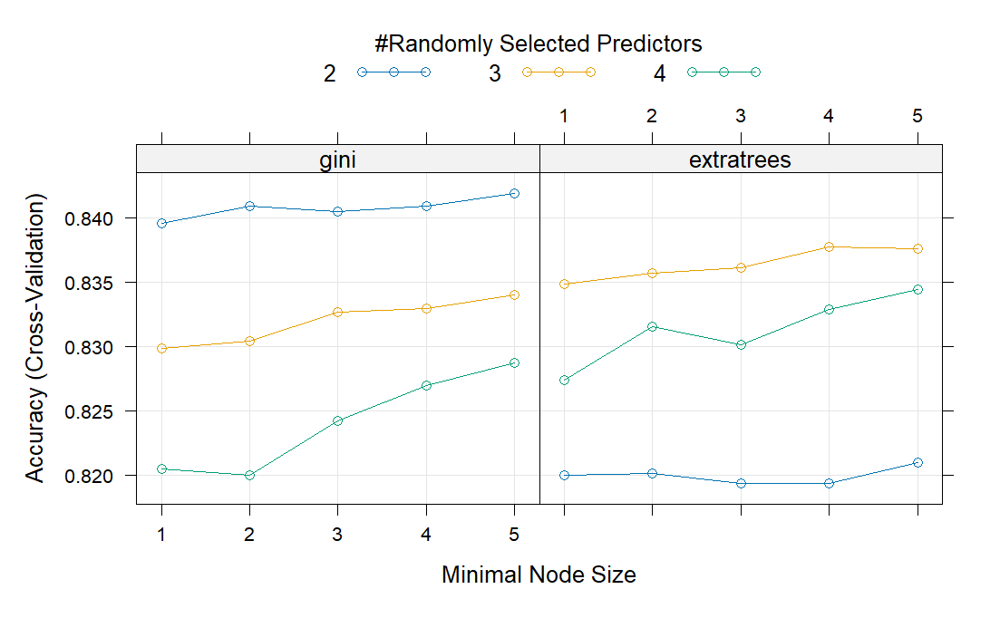{width=80%}
---
{width=80%}
---
# Challenges

- It was difficult working with so much code, realized I had to separate into smaller chunks
-Difficult to vary graphs, tried to think of relevant, but unobvious combinations
-Part 3 took very long to run

---


